# Video Approval & Ingestion Workflow

## The Problem You Encountered

When you approve videos in the admin dashboard, they were being marked as `'approved'` in the database but **not automatically queued for ingestion** into ChromaDB.

## The Solution

I've added automatic queueing to the approval workflow. Now when you approve a video, it will:

1. ✅ Update status to `'approved'` in PostgreSQL
2. 📥 Fetch the transcript (using Apify to avoid IP blocks)
3. 🚀 Queue the video to `tasks.video.validated` in RabbitMQ
4. 🤖 Workers automatically process and embed into ChromaDB

## Three Ways to Queue Approved Videos

### Option 1: Admin Dashboard (Recommended for New Approvals)

The admin dashboard now **automatically queues** videos when you approve them:

```bash
# Start the dashboard
streamlit run autodidact/ui/admin_dashboard.py
```

**What happens when you click "✅ Approve":**
- Status updated to `'approved'`
- Video automatically queued for ingestion
- Toast notification confirms queueing
- Workers process in background

**New Feature: Batch Approve All**
- Click "🚀 Approve & Queue All" button
- Approves and queues ALL pending videos at once
- Perfect for bulk processing

### Option 2: Batch Queue Script (Recommended for Existing Approvals)

If you already approved videos manually in the database, use this script to queue them:

```bash
# Queue all approved videos
python scripts/batch_queue_approved.py

# Queue only 10 videos (for testing)
python scripts/batch_queue_approved.py --limit 10

# Dry run to see what would be queued
python scripts/batch_queue_approved.py --dry-run
```

**What it does:**
- Finds all videos with `status='approved'`
- Fetches transcripts via Apify
- Queues each to RabbitMQ
- Shows progress with detailed logging

### Option 3: Manual Single Video Queue

For queueing a specific video by ID:

```bash
python scripts/queue_approved_video.py <video_id>

# Example
python scripts/queue_approved_video.py dQw4w9WgXcQ
```

## Complete Workflow

### Initial Setup (One-time)

```bash
# 1. Start infrastructure
docker-compose up -d

# 2. Start workers
python -m src.workers.transcription_worker &
python -m src.workers.quality_assessment_worker &
python -m src.workers.embedding_worker &
```

### Ongoing Video Review Process

```mermaid
graph TD
    A[Videos scraped] --> B[Quality assessment]
    B --> C{Passes threshold?}
    C -->|Yes| D[Auto-approved & queued]
    C -->|No| E[Status: pending_review]
    E --> F[Admin reviews in dashboard]
    F --> G{Approve?}
    G -->|Yes| H[✅ Auto-queued for ingestion]
    G -->|No| I[❌ Status: rejected]
    H --> J[Workers process]
    J --> K[Embedded in ChromaDB]
```



### Daily Workflow

1. **Open Admin Dashboard**
   ```bash
   streamlit run autodidact/ui/admin_dashboard.py
   ```

2. **Navigate to "📋 Video Review Queue"**

3. **Review Videos**
   - Watch video
   - Check quality score
   - Read rejection reason

4. **Take Action**
   - **Individual:** Click "✅ Approve" on each video
   - **Bulk:** Click "🚀 Approve & Queue All" button

5. **Videos Auto-Queue**
   - No manual intervention needed
   - Workers process automatically
   - Check progress in logs

## Troubleshooting

### Issue: "Videos not appearing in ChromaDB"

**Check 1: Are workers running?**
```bash
# Check worker processes
ps aux | grep worker

# Or check docker
docker-compose logs -f embedding_worker
```

**Check 2: Is RabbitMQ running?**
```bash
# Check RabbitMQ management UI
open http://localhost:15672
# Login: autodidact / rabbitmq_password
```

**Check 3: Check queue status**
```bash
# View message count in queue
python -c "
import pika
credentials = pika.PlainCredentials('autodidact', 'rabbitmq_password')
connection = pika.BlockingConnection(pika.ConnectionParameters('localhost', credentials=credentials))
channel = connection.channel()
result = channel.queue_declare(queue='tasks.video.validated', passive=True)
print(f'Messages in queue: {result.method.message_count}')
connection.close()
"
```

### Issue: "Transcript fetch fails"

**Cause:** Apify API token missing or invalid

**Solution:**
```bash
# Check .env file
cat .env | grep APIFY_API_TOKEN

# If missing, add it:
echo "APIFY_API_TOKEN=your_token_here" >> .env

# Restart dashboard/script
```

### Issue: "Already approved but not queued"

**Solution:** Use batch queue script
```bash
# Queue all previously approved videos
python scripts/batch_queue_approved.py
```

## Queue Architecture

```
┌─────────────────────┐
│  Admin Dashboard    │
│  OR Batch Script    │
└──────────┬──────────┘
           │
           │ publishes
           ▼
┌─────────────────────┐
│ tasks.video.        │
│     validated       │ ◄─── Queue name
└──────────┬──────────┘
           │
           │ consumes
           ▼
┌─────────────────────┐
│  Embedding Worker   │
└──────────┬──────────┘
           │
           │ stores
           ▼
┌─────────────────────┐
│     ChromaDB        │
└─────────────────────┘
```

## Key Files Modified

1. **`autodidact/ui/admin_dashboard.py`**
   - Added `queue_approved_video_for_ingestion()` function
   - Modified `update_status_callback()` to auto-queue
   - Added "🚀 Approve & Queue All" batch button

2. **`scripts/batch_queue_approved.py`** (NEW)
   - Finds all approved videos
   - Fetches transcripts
   - Queues for ingestion
   - Dry-run mode for testing

3. **`scripts/queue_approved_video.py`** (EXISTING)
   - Manual single-video queueing
   - Useful for specific cases

## Next Steps

1. **Test the fix:**
   ```bash
   # Start dashboard
   streamlit run autodidact/ui/admin_dashboard.py
   
   # Approve a video
   # Should see "Video queued for ingestion!" toast
   ```

2. **Queue existing approvals:**
   ```bash
   # Dry run first
   python scripts/batch_queue_approved.py --dry-run
   
   # If looks good, run for real
   python scripts/batch_queue_approved.py
   ```

3. **Monitor workers:**
   ```bash
   # Watch embedding worker logs
   docker-compose logs -f embedding_worker
   ```

## Future Improvements

- [ ] Add ingestion status to admin dashboard
- [ ] Show queue position/ETA
- [ ] Add "Re-queue failed" button
- [ ] Cross-check with ChromaDB to avoid re-queueing
- [ ] Add webhook notifications when ingestion completes
- [ ] Store transcripts in S3 to avoid re-fetching (see `Improvements.md`)

---

**You're all set!** Videos approved in the dashboard will now automatically queue for ingestion. 🚀
